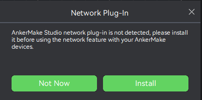

# Building AnkerMake Studio on Mac OS

## 0. Prerequisities
To build AnkerMake Studio on Mac OS, you will need the following software:

- XCode from app store
- CMake
- Git
- gettext
- FFmepg
- openssl
- jansson

XCode is available through Apple's App Store, the other three tools are available on
[brew](https://brew.sh/) (use `brew install cmake git gettext` to install them).

## 1. Download sources
Clone the respository. Use a directory relatively close to the drive root, so the path is not too long. Avoid spaces and non-ASCII characters, run:
```
mkdir src
cd src
git clone https://github.com/ankermake/AnkerMake-PrusaSlicer-Release.git
```

## 2. Build Instructions

### Compile and Install the dependencies.
run the following:

	1. cd src/AnkerStudio/deps
	2. mkdir src/AnkerStudio/deps/deps_build
	3. cd src/AnkerStudio/deps/deps_build
	4. cmake ..
	5. make -jN
	6. build the dependency library to src/AnkerStudio/deps/deps_build/destdir
	7. Install some other dependency librarys: jansson, FFmepg, openssl

Note that `N` is the number of CPU cores, so, for example `make -j4` for a 4-core machine.
The library and include path for dependencies should reference `AnkerStudio\src\slic3r\CMakeLists.txt`

### Generate XCode project file for AnkerMake Studio.

	1. update deps_arm_dir to src/AnkerStudio/deps/deps_build/destdir in src/AnkerStudio/gen_xcode_proj.sh 
	2. mkdir -p src/AnkerStudio/build_xcode/src/Debug
	3. bash src/gen_xcode_proj.sh to generate XCode project

Note that `deps_arm_dir` must be absolute path. A relative path will not work.
Note that `mkdir -p src/AnkerStudio/build_xcode/src/Debug` change to `mkdir -p src/AnkerStudio/build_xcode/src/Release` when you select release build.

### Compile and Run AnkerMake Studio. 
Click `src\AnkerStudio\build_xcode\AnkerStudio.xcodeproj` to open it in XCode (This should open up XCode where you can perform build using the GUI or perform other tasks.).

Select `AnkerStudio` as your startup project, as shown in the figure below:

  


Click the run button to compile and run AnkerMake Studio.


AnkerMake Studio should start. You're up and running!

### Network Plugin
If you need to use network functions or device control functions, then you need to install the network plug-in, as shown in the figure below:



Note that AnkerMake Studio must use Release mode when downloading and using network plug-ins.

How to use release mode refer to the figure below：


