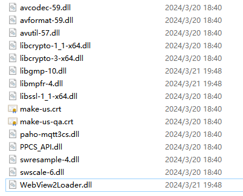
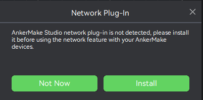

# Building eufyMake Studio on Windows


## 0. Prerequisities

The following tools need to be installed on your computer:
- Visual Studio Community 2019 from [visualstudio.microsoft.com/vs/](https://visualstudio.microsoft.com/zh-hans/vs/) (Older versions are not supported as Bambu Studio requires support for C++17, and newer versions should also be ok);
- Cmake from [cmake.org](https://cmake.org/download/)
- Git from [gitforwindows.org](https://gitforwindows.org/)
- FFmepg from [ffmpeg.org](https://ffmpeg.org/)
- openssl from [openssl.org](https://www.openssl.org/)
- jansson from [jansson](https://jansson.readthedocs.io/en/2.13/index.html)


## 1. Download sources

Clone the respository. Use a directory relatively close to the drive root, so the path is not too long. Avoid spaces and non-ASCII characters, run:
```
mkdir src
cd src
<<<<<<< HEAD
git clone git@github.com:ankermake/AnkerMake-PrusaSlicer-Release.git
=======
git clone https://github.com/ankermake/AnkerMake-PrusaSlicer-Release.git
>>>>>>> 84b4984 (feat: 1.5.21 open source)
```


## 2. Build Instructions

### Compile and Install the dependencies.

<<<<<<< HEAD
	1. cd src\AnkerMake-PrusaSlicer-Release\AnkerStudio\deps
	2. mkdir src\AnkerMake-PrusaSlicer-Release\AnkerStudio\deps\deps_build
	3. cd src\AnkerMake-PrusaSlicer-Release\AnkerStudio\deps\deps_build
	4. cmake -DCMAKE_BUILD_TYPE=Debug -S .. -G "Visual Studio 16 2019"
	5. Open the project and build the dependency library to src\AnkerMake-PrusaSlicer-Release\AnkerStudio\deps\deps_build\destdir
	6. Install some other dependency librarys: jansson, FFmepg, openssl
	7. Set system environment variables:  THIRD_PART_ROOT = src\AnkerMake-PrusaSlicer-Release\AnkerStudio\deps\deps_build\destdir

Note that `THIRD_PART_ROOT` must be absolute path. A relative path will not work.
The library and include path for dependencies should reference `src\AnkerMake-PrusaSlicer-Release\AnkerStudio\src\slic3r\CMakeLists.txt`
=======
	1. cd src\AnkerStudio\deps
	2. mkdir src\AnkerStudio\deps\deps_build
	3. cd src\AnkerStudio\deps\deps_build
	4. cmake -DCMAKE_BUILD_TYPE=Debug -S .. -G "Visual Studio 16 2019"
	5. Open the project and build the dependency library to src\AnkerStudio\deps\deps_build\destdir
	6. Install some other dependency librarys: jansson, FFmepg, openssl
	7. Set system environment variables:  THIRD_PART_ROOT = src\AnkerStudio\deps\deps_build\destdir

Note that `THIRD_PART_ROOT` must be absolute path. A relative path will not work.
The library and include path for dependencies should reference `AnkerStudio\src\slic3r\CMakeLists.txt`
>>>>>>> 84b4984 (feat: 1.5.21 open source)

### Generate Visual Studio project file for eufyMake Studio.

```
<<<<<<< HEAD
mkdir src\AnkerMake-PrusaSlicer-Release\AnkerStudio\build
mkdir src\AnkerMake-PrusaSlicer-Release\AnkerStudio\build\src\Debug
cd src\AnkerMake-PrusaSlicer-Release\AnkerStudio\build
cmake -DCMAKE_BUILD_TYPE=Debug -S .. -G "Visual Studio 16 2019"
```
Note that `mkdir src\AnkerMake-PrusaSlicer-Release\AnkerStudio\build\src\Debug` change to `mkdir src\AnkerMake-PrusaSlicer-Release\AnkerStudio\build\src\Release` when you select release build.

### Compile and Run eufyMake Studio.

Copy `src\AnkerMake-PrusaSlicer-Release\AnkerStudio\resources\crt` files to `src\AnkerMake-PrusaSlicer-Release\AnkerStudio\build\src\Debug` or `src\AnkerMake-PrusaSlicer-Release\AnkerStudio\build\src\Release`.

Copy some other dependent files to `src\AnkerMake-PrusaSlicer-Release\AnkerStudio\build\src\Debug` or `src\AnkerMake-PrusaSlicer-Release\AnkerStudio\build\src\Release`, as show in the figure: 



`PPCS_API.dll`, `paho-mqtt3cs.dll` in `src\AnkerMake-PrusaSlicer-Release\AnkerStudio\deps\bin\win\x64`
`WebView2Loader.dll` in `src\AnkerMake-PrusaSlicer-Release\AnkerStudio\pack\windows\runtime\WebView2Loader.dll`
The other ones are openssl and ffmepg libraries.

Double-click `src\AnkerMake-PrusaSlicer-Release\AnkerStudio\build\AnkerStudio.sln` to open in Visual Studio and select `AnkerStudio_app_console` as your startup project (right-click->Set as Startup Project).
=======
mkdir src\AnkerStudio\build
mkdir src\AnkerStudio\build\src\Debug
cd src\AnkerStudio\build
cmake -DCMAKE_BUILD_TYPE=Debug -S .. -G "Visual Studio 16 2019"
```
Note that `mkdir src\AnkerStudio\build\src\Debug` change to `mkdir src\AnkerStudio\build\src\Release` when you select release build.

### Compile and Run AnkerMake Studio. 

Copy `AnkerStudio\resources\crt` files to `src\AnkerStudio\build\src\Debug` or `src\AnkerStudio\build\src\Release`.

Copy some other dependent files to `src\AnkerStudio\build\src\Debug` or `src\AnkerStudio\build\src\Release`, as show in the figure: 


`PPCS_API.dll`, `paho-mqtt3cs.dll` in `AnkerStudio\deps\bin\win\x64`
`WebView2Loader.dll` in `AnkerStudio\pack\windows\runtime\WebView2Loader.dll`
The other ones are openssl and ffmepg libraries.

Double-click `src\AnkerStudio\build\AnkerStudio.sln` to open in Visual Studio and select `AnkerStudio_app_console` as your startup project (right-click->Set as Startup Project).
>>>>>>> 84b4984 (feat: 1.5.21 open source)

Run `Build->Rebuild` Solution once to populate all required dependency modules. This is NOT done automatically when you `Build/Run`. If you run both Debug and Release variants, you will need to do this once for each.

`Debug->Start Debugging` or press F5

eufyMake Studio should start. You're up and running!

### Network Plugin
If you need to use network functions or device control functions, then you need to install the network plug-in, as shown in the figure below:



Note that eufyMake Studio must use Release mode when downloading and using network plug-ins.


